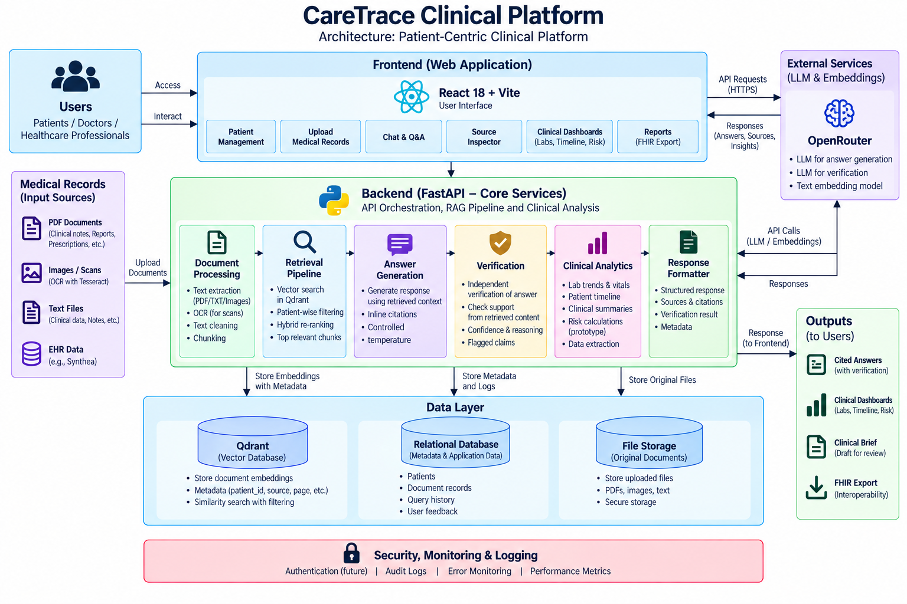

# CareTrace Clinical Platform

An educational full-stack prototype for asking evidence-backed questions about a **selected patient's** medical records. It accepts PDF, image, and text records; converts them into searchable chunks; retrieves only chunks belonging to the active patient; generates a cited answer; and runs a second LLM pass to audit that answer against the retrieved evidence.

The repository uses synthetic Synthea EHR data for its included dataset and demonstrations. It is **not a clinical device**, does not provide medical advice, and must not be used for diagnosis, treatment, or real patient data without the security, privacy, validation, and governance work described below.

## What the project does

| Area | Capability |
| --- | --- |
| Record ingestion | Reads PDFs, plain-text files, and images; images use Tesseract OCR when installed. Text is redacted for selected PHI patterns, split into overlapping chunks, embedded, and stored in Qdrant. |
| Patient isolation | Every vector search includes a mandatory Qdrant `patient_id` filter. Retrieved chunks retain source filename, page, chunk index, document type, and text. |
| Question answering | Expands common clinical acronyms, retrieves 8 vector candidates, hybrid re-ranks them with dense and lexical scores, and passes the best 5 excerpts to the answer model. |
| Evidence and verification | Answers must cite sources or return `Information not found in medical records.` A second LLM verifies each answer against the same retrieved context and returns `VERIFIED` or `NEEDS_REVIEW`. |
| Clinical workspace | React views for chat, source inspection, patient documents, lab trends, chronological timelines, clinical summaries, medication safety checks, risk profiles, FHIR R4 export, and audit metrics. |
| Governance | Query/audit logging, thumbs-up/down feedback, a small in-memory semantic response cache, and a deterministic regex-based PHI sanitizer for selected patterns. |

## Architecture



```text
PDF / image / text upload
  -> text extraction (Tesseract OCR for images when available)
  -> selected PHI-pattern redaction
  -> 600-character chunks with 100-character overlap
  -> OpenRouter embedding API
  -> Qdrant: vector + patient_id + source metadata

Question + active patient_id
  -> acronym expansion
  -> patient-filtered Qdrant cosine search (8 candidates)
  -> dense + lexical hybrid re-ranking (top 5)
  -> OpenRouter answer LLM (temperature 0, inline citations)
  -> independent OpenRouter verifier LLM
  -> answer, sources, audit result, latency -> React UI
```

The `patient_id` filter is implemented in the Qdrant query, rather than relying only on an LLM prompt. A `VERIFIED` result means that the verifier considered the generated answer supported by the retrieved excerpts; it does not establish clinical correctness, record completeness, OCR accuracy, or safety for clinical use.

## Tech stack

| Layer | Technology |
| --- | --- |
| Web app | React 18, Vite 5, Axios, Lucide React |
| API | Python, FastAPI, Uvicorn, Pydantic |
| Retrieval | Qdrant, cosine similarity, patient metadata filter, simple hybrid re-ranking |
| AI provider | OpenRouter via the OpenAI-compatible SDK; default models are configurable in `.env` |
| Embeddings | Configurable OpenRouter embedding model; the supplied configuration uses `openai/text-embedding-3-small` with 1,536 dimensions |
| Document processing | PyPDF, Pillow, PyTesseract (optional system Tesseract executable) |
| Data | Synthea synthetic FHIR/EHR JSON from Kaggle, converted to JSONL manifest records |
| Optional fine-tuning | Hugging Face Transformers, Datasets, PEFT, TRL, BitsAndBytes; LoRA/QLoRA notebook and script |

## Repository layout

```text
backend/
  app/
    main.py                    FastAPI routes and orchestration
    rag_chain.py               Retrieval, prompting, cited answer generation
    qdrant_client.py           Qdrant collection, storage, and patient filtering
    verifier.py                Second-pass answer auditing
    document_processor.py      PDF/text/image extraction and chunking
    clinical_analytics.py      Lab trends, timeline, summaries, drug checks
    clinical_calculators.py    Prototype ASCVD/eGFR/risk logic
    fhir_exporter.py           FHIR R4 bundle export
    audit_logger.py            JSONL audit entries and user feedback
    phi_sanitizer.py           Regex redaction for SSN, email, and phone patterns
  prepare_synthea.py           Download/normalize Synthea into a patient manifest
  ingest_synthea.py            Embed and load a manifest split into Qdrant
  evaluate_rag.py              RAG benchmark runner and report exporter
  create_finetuning_dataset.py Build SFT train/validation JSONL examples
  finetune_lora.py             Optional LoRA/QLoRA trainer
  requirements.txt             Runtime dependencies
frontend/
  src/                         React application and feature components
  vite.config.js               Port 3000 and `/api` proxy to port 8000
```

## Why this project matters

Medical records are often fragmented across notes, lab reports, scans, PDFs, and structured EHR exports. Looking for one fact can require reading many documents, and a general chatbot may produce a plausible answer without showing where it came from. This project demonstrates an evidence-first alternative:

1. **Faster record navigation:** semantic search can surface relevant record excerpts without relying only on exact keywords.
2. **Traceability:** the user can inspect the document, page, excerpt, and retrieval score behind an answer.
3. **Isolation by patient:** retrieval is constrained in the database to the active patient ID, which reduces the risk of mixing records across patients.
4. **Safer uncertainty handling:** the answer model is instructed to abstain when the retrieved evidence does not contain the requested fact.
5. **Review support:** a second model audit, feedback buttons, and audit logs make it easier to identify answers requiring human review.

These are design goals, not guarantees. The application is most useful as a prototype for information retrieval and workflow assistance, with a trained human responsible for reviewing original records and making decisions.

## Where it can be used

With synthetic or properly governed data, this pattern can support:

| Setting | Example use |
| --- | --- |
| Clinical-record review prototype | Locate documented medications, diagnoses, observations, procedures, and dates in a selected patient's record. |
| Health-data research | Explore retrieval quality, grounded generation, abstention behavior, and patient-isolation controls on synthetic EHR data. |
| Medical-document operations | Demonstrate how PDF, note, and scan content could be indexed and cited for staff review. |
| Education and demonstrations | Teach RAG architecture, source citation, model verification, FHIR export, and evaluation design. |
| Internal knowledge-assistant experiments | Adapt the same patient-isolated, evidence-backed pattern to other document domains such as legal, finance, support, or policy records. |

It is not suitable for direct patient care, automated diagnosis, prescribing, triage, or use with real patient data as checked in. Those uses require clinical validation, security controls, privacy/legal review, and human oversight.

## Frontend pages and controls

After selecting a patient in the left sidebar, the main navigation exposes five workspace pages. All pages are scoped to the active patient ID.

| Page / UI area | What it contains | Why or when to use it |
| --- | --- | --- |
| **Patient sidebar** | API/Qdrant connection status, patient list, create/select/delete controls, uploaded-document summary, and an upload button. | Start here to choose the patient context. Deleting or clearing records removes vectors from Qdrant, so use it carefully. |
| **Upload records modal** | Drag-and-drop/file picker for PDF, TXT, PNG, JPG/JPEG, BMP, and TIFF files; processing result and chunk count. | Add demo records for the active patient. Files are extracted, redacted for limited patterns, chunked, embedded, and indexed. |
| **Medical Chat** | Quick prompts, question box, answer, source list, verification badge/details, answer latency, transcript export, and thumbs-up/down feedback. | Ask record-specific questions such as documented medications or lab readings. Open a source to check the original retrieved excerpt before relying on an answer. |
| **Source Inspector** | Filename, page, document type, hybrid match score, vector similarity, and the exact retrieved text. | Open it from a chat answer to validate the model's citation and understand why the source was retrieved. |
| **Lab Trends & Vitals** | Parsed laboratory/vital measurement cards with latest value, reference range, status, and time-series values when extractable. | Review structured signals found in indexed text. Empty results mean the current parser did not recognize structured measurements; they do not prove that a record lacks labs. |
| **Patient Timeline** | Chronological conditions, procedures, medications, immunizations, and observations parsed from patient chunks. | Quickly review a longitudinal record. It is a parser-derived view, so confirm important events in the source record. |
| **Clinical Brief** | On-demand LLM-generated consultation/discharge-style summary with copy and Markdown export controls. | Create a draft for review or demonstration. It is not a signed clinical note and needs human validation. |
| **Risk & Differential** | Prototype ASCVD/eGFR estimates, rule-derived ICD-10-style differential alerts, supporting values, and FHIR R4 JSON preview/download. | Demonstrate structured-data extraction, risk framing, and interoperability export. The calculator is heuristic/prototype logic, not a validated clinical calculator. |
| **Verification badge** | `VERIFIED` or `NEEDS REVIEW`, verifier confidence, reasoning, and flagged claims. | Inspect whether a second LLM judged the answer supported by the retrieved excerpts. Treat it as a review signal, not proof of truth. |
| **Audit dashboard component** | Total logged queries, verifier rate/confidence, latency, feedback counts, and recent audited interactions. | The component and API are present for governance demonstrations. It is not currently wired into the five main tabs in `App.jsx`; it can be added as an administrator view. |

## Typical user flow

1. Start the backend and frontend.
2. Create or select a demo patient in the sidebar.
3. Upload that patient's synthetic PDF, text, or image records.
4. Wait for the upload confirmation showing how many chunks were indexed.
5. Use **Medical Chat** to ask a question about that patient only.
6. Read the answer, open the cited sources, and inspect the verifier result.
7. Use Timeline, Lab Trends, Clinical Brief, and Risk & Differential only as review aids; validate important information against original documents.
8. Record feedback on the chat answer and review audit data when evaluating the prototype.

## Prerequisites

- Python 3.10+ and `pip`
- Node.js 18+ and npm
- An OpenRouter API key with access to the selected chat and embedding models
- Optional: Docker for a separate Qdrant service (embedded Qdrant is the default)
- Optional: install the [Tesseract OCR executable](https://github.com/tesseract-ocr/tesseract) and make it available on `PATH` to OCR image uploads
- Optional, only for fine-tuning: NVIDIA CUDA GPU and the additional Hugging Face dependencies shown below

## Run locally

The provided `.env.example` defaults to embedded, file-backed Qdrant (`QDRANT_URL=local`). That is the shortest path: no Docker service is required.

### 1. Configure and start the backend

PowerShell:

```powershell
cd backend
Copy-Item .env.example .env
```

Edit `backend/.env`, at minimum setting a valid `OPENROUTER_API_KEY`. Keep the embedding dimension matched to the embedding model and use a fresh collection whenever that dimension changes.

```ini
OPENROUTER_API_KEY=replace-with-your-key
PRIMARY_LLM_MODEL=meta-llama/llama-3.2-3b-instruct:free
VERIFIER_LLM_MODEL=meta-llama/llama-3.2-3b-instruct:free
EMBEDDING_MODEL=openai/text-embedding-3-small
EMBEDDING_VECTOR_SIZE=1536
QDRANT_URL=local
QDRANT_PATH=qdrant_storage
QDRANT_COLLECTION=medical_records_openrouter
```

Install the runtime dependencies, initialize the collection, and start the API:

```powershell
pip install -r requirements.txt
python init_qdrant.py
uvicorn app.main:app --reload --port 8000
```

The interactive API documentation is then available at `http://localhost:8000/docs`, and the health endpoint is `http://localhost:8000/api/health`.

### 2. Start the frontend

Open a second terminal:

```powershell
cd frontend
npm install
npm run dev
```

Open `http://localhost:3000`. Vite proxies `/api` requests to the backend at port 8000.

### First successful demo

1. In the browser, create a patient ID such as `DEMO-001`.
2. Click **Upload Records** and add synthetic/sample files.
3. Wait for the confirmation that files were processed and vectors were stored.
4. Open **Medical Chat** and ask, for example, `What medications are documented for this patient?`
5. Expand the sources, open **Source Inspector**, and read the verifier's audit details.

If the screen shows that the backend is offline, confirm that `uvicorn app.main:app --reload --port 8000` is still running and browse to `http://localhost:8000/api/health`.

### Using a standalone Qdrant service instead

If you prefer Docker Qdrant, start it from the repository root:

```powershell
docker run --rm -p 6333:6333 -p 6334:6334 -v "${PWD}/qdrant_storage:/qdrant/storage" qdrant/qdrant
```

Then set `QDRANT_URL=http://localhost:6333` in `backend/.env` (rather than `local`) and run `python init_qdrant.py`. Do not point a collection at vectors created with a different embedding size.

## API at a glance

| Endpoint | Description |
| --- | --- |
| `GET /api/health` | API, Qdrant, collection, and selected-model status |
| `GET/POST/DELETE /api/patients` | List, create/select, or clear patient records |
| `POST /api/upload` | Process multipart files for a patient and store chunks |
| `POST /api/chat` | Return a cited RAG answer plus verification and audit metadata |
| `POST /api/chat/stream` | Stream answer tokens with server-sent events (this route does not run the verifier or audit logger) |
| `GET /api/patient/{id}/documents`, `/labs`, `/timeline`, `/risk-calculator`, `/fhir` | Patient document, analytics, risk, and export views |
| `POST /api/patient/{id}/summarize`, `/safety-check` | LLM summary and rule-based medication safety response |
| `POST /api/feedback`, `GET /api/audit-logs` | Feedback and audit dashboard data |

## Dataset, indexing, and split

The checked-in Synthea manifest contains **24,915 synthetic patient records**:

| Split | Patients | Purpose |
| --- | ---: | --- |
| Train | 19,840 | RAG index source and optional SFT-example source |
| Test | 5,075 | Hold-out patients for evaluation or optional validation-example source |

`prepare_synthea.py` assigns each patient deterministically by SHA-256 hash: approximately 80% train and 20% test. It does not train a model; its normal RAG use is to create a manifest and index only the desired split.

```powershell
cd backend
# Downloads the ~2.17 GB Kaggle source, then writes data/processed/synthea_manifest.jsonl
python prepare_synthea.py --download

# Index training patients. Use a small limit first as a smoke test.
python ingest_synthea.py --split train --limit 20

# Full index (requires API capacity and can take substantial time/cost)
python ingest_synthea.py --split train --limit 0
```

Keep the test split out of the serving collection when measuring generalization. The current `evaluate_rag.py` prioritizes indexed patients and is useful as a smoke benchmark; for a strict held-out evaluation, index an isolated test-only collection or adapt the evaluator so it selects only `split == "test"` records. Never evaluate by mixing a patient into both the indexed training collection and the test set.

## Optional supervised fine-tuning

RAG works without fine-tuning. The optional fine-tuning path creates grounded chat examples containing either a source-supported answer or the exact abstention response, then trains a LoRA/QLoRA adapter.

The repository currently includes **1,000** generated training examples and **200** validation examples in `backend/data/processed/`.

```powershell
cd backend
python create_finetuning_dataset.py --max-train 2000 --max-val 400
pip install transformers datasets peft trl bitsandbytes accelerate torch
python finetune_lora.py --epochs 1 --batch-size 2 --grad-accum 8
```

The trainer defaults to `mistralai/Ministral-3-3B-Instruct-2512`, LoRA rank 16, alpha 32, and 4-bit quantization when CUDA is available. It saves the adapter under `backend/models/ministral_synthea_lora`. The running FastAPI application calls OpenRouter and **does not automatically load this adapter**; serving a fine-tuned model requires a separate inference/deployment integration.

## Evaluation and current benchmark

Run the existing full-pipeline evaluator after configuring the backend and indexing records:

```powershell
cd backend
python evaluate_rag.py --sample-size 20
```

It writes detailed per-case results to `evaluation_results.json` and a Markdown summary to `evaluation_report.md`. The existing saved run (2026-09-02) used `mistral-small-latest` for both answer generation and verification, `mistral-embed`, and 10 cases (5 answerable / 5 unanswerable controls).

| Metric | Saved result | Interpretation |
| --- | ---: | --- |
| Grounded-answer rate | 80.0% (8/10) | Script-defined rate across all cases; two answerable cases abstained. |
| Unsupported-claim rate | 0.0% (0/10) | No generated answer was marked unsupported by the verifier. |
| Retrieval recall@5 | 90.0% (9/10) | Current script treats unanswerable controls as retrieval successes; report answerable-only recall separately in a formal study. |
| Abstention accuracy | 80.0% (8/10) | Correct found/not-found behavior over the 10 cases. |
| Citation precision | 100.0% | Valid source-number references under the script's citation check. |
| Patient-isolation violations | 0 | No retrieved chunk had a different patient ID. |
| Verifier status `VERIFIED` | 100.0% | Verifier output agreed with all outputs in this small run. |
| Mean end-to-end latency | 2.39 s | RAG generation plus verifier call. |

These are prototype measurements, not clinical performance claims: the sample is only 10 cases, labels are programmatically derived, the verifier is model-based, and the answer and verifier used the same model family. Use clinician-adjudicated labels, a strict patient-level hold-out split, an independent evaluator, confidence intervals, and a versioned index/model snapshot before making comparative or clinical claims.

### Abstention confusion matrix (saved 10-case run)

This confusion matrix treats **“information is absent from the record”** as the positive class and treats the exact not-found response as the model prediction. It is the meaningful classification matrix available from the stored test results; the RAG task is otherwise generative, not a diagnosis classifier.

| Actual record state \ Predicted behavior | Answer found | Not found / abstained |
| --- | ---: | ---: |
| Answerable (5) | 3 | 2 |
| Unanswerable control (5) | 0 | 5 |

Thus, for abstention: TP = 5, FP = 2, FN = 0, TN = 3; accuracy = **80.0%**, abstention precision = **71.4%**, recall = **100.0%**, and F1 = **83.3%**. The two false-positive abstentions correspond to answerable questions where the system returned the not-found response. This is a useful signal to improve retrieval, prompt behavior, and evidence coverage.

### Metrics to report for a robust train/test experiment

| Metric | Calculation / purpose |
| --- | --- |
| Retrieval Recall@k | Share of answerable test questions where the annotated evidence chunk appears in the top *k* retrieved chunks. Report on answerable cases only. |
| Grounded-answer rate | Share of answers whose claims are fully supported by the cited retrieved excerpts, assessed by an independent rubric or human reviewer. |
| Unsupported-claim rate | Share of responses containing at least one claim not supported by the context; lower is better. |
| Citation precision and recall | Whether supplied citations support the claims, and whether required claims receive supporting citations. |
| Abstention precision/recall/F1 | Ability to abstain when the record lacks the fact without incorrectly abstaining when evidence exists. Include the confusion matrix above for every test run. |
| Patient-isolation violations | Number of retrieved chunks or answer claims associated with another patient. Target: exactly zero. |
| Verifier agreement | Agreement between the automatic verifier and independent human/adjudicated grounding labels. |
| Latency and cost | Median/p95 response time and per-query model cost for retrieval, generation, and verification. |

For reproducibility, record the manifest hash, patient split, collection/index snapshot, chunk parameters, embedding model and vector size, answer/verifier models, prompts, evaluation questions, random seed, evaluator method, and confidence intervals.

## Important limitations and security notes

- The regex sanitizer detects only limited patterns (SSN, email, phone); it is not complete PHI de-identification.
- CORS is permissive, there is no authentication or authorization, embedded Qdrant and audit logs are local files, and uploaded data has no production retention/encryption controls.
- The risk calculator and medication safety features are prototype heuristics, not validated medical calculators or decision support.
- OCR and source extraction can be incomplete or incorrect. A cited result may still be based on an extraction error or incomplete retrieval.
- Upload processing is synchronous, and document size/type/malware safeguards are not production-grade.

Before handling real health data, add identity and patient/tenant authorization, TLS, encryption at rest, managed secrets, strict CORS, audit immutability, retention/deletion controls, rate limits, file validation and malware scanning, observability, human review, formal security testing, clinical validation, and appropriate regulatory review.

## License and data notice

No project license is currently included. Review the Synthea and Kaggle dataset terms before redistribution or deployment. The project is intended for synthetic/demo data and educational development only.
